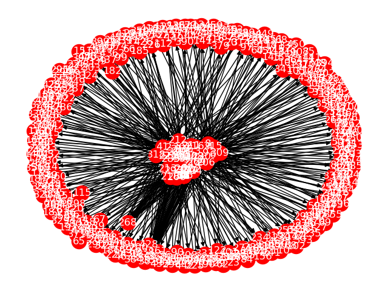

# Graph

`Graph` adalah kumpulan dari titik ( node ) dan garis dimana pasangan-pasangan titik ( node ) tersebut dihubungkan oleh segmen garis. Node ini biasa disebut simpul (verteks) dan segmen garis disebut ruas (edge).


```python
g = nx.from_pandas_edgelist(edgelistBox, "From", "To", None, nx.DiGraph())
pos = nx.spring_layout(g)

nx.draw(g, pos)
nx.draw_networkx_labels(g, pos, label, font_color="w")

plt.axis("off")
plt.show()
```

Code diatas menggunakan Networkx untuk membentuk graph berarah, kemudian kita visualisasikan menggunakan Matplotlib.

Ini adalah graph yang dihasilkan dari website  '<https://palominobag.com/best-seller>':



