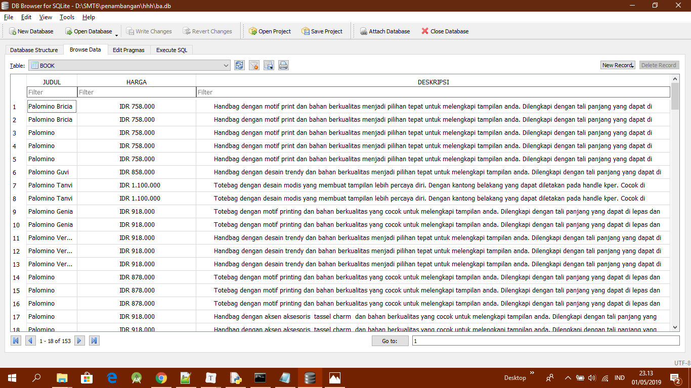

# Proses Web Crawling

### **Halaman Web**

Untuk website yang akan di crawl datanya yaitu:

> <https://palominobag.com/best-seller>

Data yang ada pada website tersebut sebanyak 153 data.

### **Proses Crawling**

Untuk mengakses halaman web dan tag html digunakan library:

```python
import requests 
from bs4 import BeautifulSoup
```


Untuk menghubungkan ke website dan mengambil tag html digunakan code berikut:

```python
page = requests.get(src)
soup = BeautifulSoup(page.content, 'html.parser')
links = soup.findAll(class_='product-name')
```

```python
links = soup.findAll(class_='product-name')
```

Code diatas digunakan untuk mendapatkan semua tag html pada halaman web tersebut. Dan hasinya berupa list.

Menentukan informasi apa saja yang akan diambil pada halaman web. Kemudian kita mengambil data berdasarkan class pada code html di website tersebut. Disini kita mengambil data yang berada pada class='product-name':

```python
for i in links:
	try :
        url = i.find ('a')['href']
        print(url)
        page = requests.get(url)
        soup = BeautifulSoup(page.content, 'html.parser')
        konten = soup.find(class_='grid_12 alpha omega')
        judul = konten.find(class_='product-name no-rel').getText()
        harga = konten.find(class_='price').getText()
        detil = konten.find(class_='box-collateral').getText(' ')
```
Untuk mengambil url yang ada pada class='product-name' digunakan:

```python
url = i.find ('a')['href']
print(url)
```


Untuk mengambil data judul, harga, dan detil barang yang berada class='product-name' dan kemudian pencarian dipersempit lagi  di class='grid_12 alpha omega' menggunakan:

```python
konten = soup.find(class_='grid_12 alpha omega')
judul = konten.find(class_='product-name no-rel').getText()
harga = konten.find(class_='price').getText()
detil = konten.find(class_='box-collateral').getText(' ')
```

Variable konten diatas menyimpan setiap data yang diambil pada class='grid_12 alpha omega' kemudian variable judul, harga,detil akan mengambil data yang telah ditampung didalam variable konten

Untuk mengambil sebanyak 153 data yang ada pada website tesebut menggunakan:

```
url=[str(i) for i in range(0,5)]
for a in url:
    src= ('https://palominobag.com/best-seller?limit=36&p='+a)
    crawl (src)
    conn.commit()
```

### **Membuat dan Menyimpan Data di Database**

Untuk membuat database dan tablenya menggunakan code dibawah ini:

```python
conn = sqlite3.connect('ba.db')
c = 1
choice = input("Update data? Y/N").lower()
if choice == 'y':
    conn.execute('drop table if exists BOOK')
    conn.execute('''CREATE TABLE BOOK
                 (JUDUL     TEXT     NOT NULL,
                 HARGA  TEXT     NOT NULL,
                 DESKRIPSI  TEXT     NOT NULL);''')
```


Kemudian data yang telah di crawl diatas disimpan kedalam table database yang telah dibuat menggunakan code dibawah ini:

```python
conn.execute("INSERT INTO BOOK \
                                VALUES (?, ?, ?)", (judul, harga, detil));
            except AttributeError:
                print("")
        conn.commit()
    except ValueError:
        print('Download selesai')
```

Ini adalah tampilan isi table dalam databasenya:

