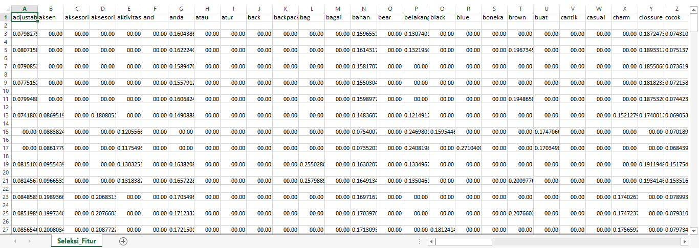

# Seleksi Fitur

### **Pengertian**

`Seleksi fitur` adalah salah satu tahapan praproses klasifikasi. Seleksi fitur dilakukan dengan cara memilih fitur-fitur yang relevan yang mempengaruhi hasil klasifikasi. Seleksi fitur digunakan untuk mengurangi dimensi data dan fitur-fitur yang tidak relevan. Seleksi fitur digunakan untuk meningkatkan efektifitas dan efisiensi kinerja dari algoritma klasifikasi.

### **Pearson Correlation**

`Pearson Correlation` digunakan untuk mengetahui ada tidaknya hubungan antara 2 variabel, yaitu variabel bebas dan variabel tergantung yang berskala interval atau rasio (parametrik). Pearson Correlation hanya mengukur kekuatan hubungan linier dan tidak pada hubungan non linier.  Harus diingat pula bahwa adanya hubungan linier yang kuat di antara variabel tidak selalu berarti ada hubungan kausalitas, sebab-akibat. Semakin tinggi nilai korelasinya maka semakin kuat hubungan antara fiturnya, tetapi jika semakin kecil nilai korelasinya maka semakin lemah hubungan antara fiturnya. Jika nilai korelasi kecil maka akan langsung di buang.

Dibawah ini adalah code untuk menyeleksi fitur dengan menggunakan Pearson Corelation:

```
def pearsonCalculate(data, u,v):
    atas=0; bawah_kiri=0; bawah_kanan = 0
    for k in range(len(data)):
        atas += (data[k,u] - meanFitur[u]) * (data[k,v] - meanFitur[v])
        bawah_kiri += (data[k,u] - meanFitur[u])**2
        bawah_kanan += (data[k,v] - meanFitur[v])**2
    bawah_kiri = bawah_kiri ** 0.5
    bawah_kanan = bawah_kanan ** 0.5
    return atas/(bawah_kiri * bawah_kanan)

def meanF(data):
    meanFitur=[]
    for i in range(len(data[0])):
        meanFitur.append(sum(data[:,i])/len(data))
    return np.array(meanFitur)

def seleksiFiturPearson(katadasar,data, threshold):
    global meanFitur
    meanFitur = meanF(data)
    u=0
    while u < len(data[0]):
        dataBaru=data[:, :u+1]
        meanBaru=meanFitur[:u+1]
        kataBaru=katadasar[:u+1]
        v = u
        while v < len(data[0]):
            if u != v:
                value = pearsonCalculate(data, u,v)
                if value < threshold:
                    dataBaru = np.hstack((dataBaru, data[:, v].reshape(data.shape[0],1)))
                    meanBaru = np.hstack((meanBaru, meanFitur[v]))
                    kataBaru = np.hstack((kataBaru, katadasar[v]))
            v+=1
        data = dataBaru
        meanFitur=meanBaru
        katadasar=kataBaru
        if u%50 == 0 : print("proses : ", u, data.shape)
        u+=1
    return data,kataBaru
```

Data dari Seleksi Fitur akan disimpan pada file CSV setelah di seleksi, kemudian hasil yang akan ditampilan yaitu kurang dari batas.

```python
batas=0.8
fiturBaru,katabaru = seleksiFiturPearson(feature_name,tfidf_matrix.toarray(), batas)
write_csv("Seleksi_Fitur.csv",[katabaru])
write_csv("Seleksi_Fitur.csv",fiturBaru,'a')
```

Ini adalah tampilan pada file csv:

