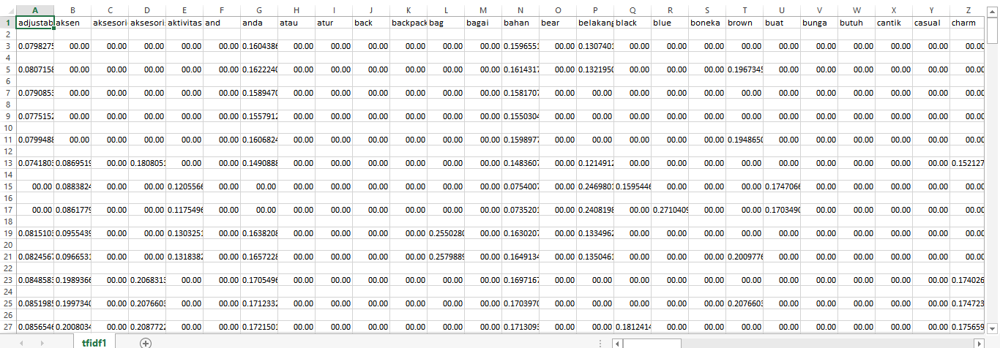

# Term Frequency dan Invers Document Frequency (TF-IDF)

### **Term Frequency (TF)**

`TF (Term Frequency)` adalah frekuensi dari kemunculan sebuah term dalam dokumen yang bersangkutan. Semakin besar jumlah kemunculan suatu term (TF tinggi) dalam dokumen, semakin besar pula bobotnya atau akan memberikan nilai kesesuaian yang semakin besar.

### **Inverse Document Frequency (IDF)**

`IDF (Inverse Document Frequency)` merupakan sebuah perhitungan dari bagaimana term didistribusikan secara luas pada koleksi dokumen yang bersangkutan.


```python
vectorizer = TfidfVectorizer()
tfidf_matrix = vectorizer.fit_transform(corpus)
feature_name = vectorizer.get_feature_names()
write_csv("tfidf1.csv", [feature_name])
write_csv("tfidf1.csv", tfidf_matrix.toarray(), 'a')
```

`TfidfVectorizer()` merupakan modul untuk vektorisasi dokumen dengan skor TF-IDF. Di belakang layar, TfidfVectorizer menggunakan estimator CountVectorizer yang gunakan untuk menghasilkan pengkodean bag-of-words untuk menghitung kemunculan token, diikuti oleh TfidfTransformer, yang menormalkan jumlah kemunculan ini dengan idf.

Ini adalah tampilan dari file csv:



