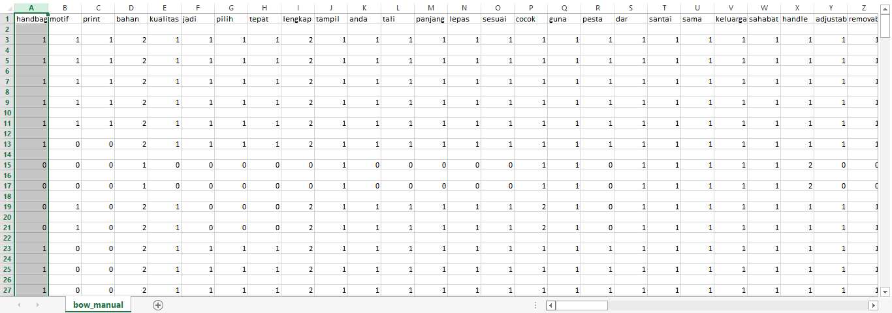

# Vector Space Model (VSM)

`Vector Space Model (VSM)` merupakan model aljabar yang merepresentasikan kumpulan dokumen sebagai vetctor. VSM dapat diaplikasikan dalam klasifikasi dokumen, clustering dokumen, dan scoring dokumen terhadap sebuah query. Dalam VSM setiap dokumen direpresentasikan sebagai sebuah vector, dimana nilai dari setiap nilai dari vector tersebut mewakili weight sebuah term.


```python
def countWord(txt):
    d = dict()
    for i  in txt.split():
        if d.get(i) == None:
            d[i] = txt.count(i)
    return d
```

Code diatas digunakan untuk menghitung banyaknya data yang ada pada dokumen.


```python
def add_row_VSM(d):
    VSM.append([])
    for i in VSM[0]:
        if d.get(i) == None:
            VSM[-1].append(0)
        else :
            VSM[-1].append(d.pop(i));
    for i in d:
        VSM[0].append(i)
        for j in range(1, len(VSM)-1):
            VSM[j].insert(-2,0)
        VSM[-1].append(d.get(i))
```

Code diatas digunakan untuk membuat matrix VSM

Code yang sudah dibuat diatas akan dipanggil dalam proses dibawah ini.

```
cursor = cursor.fetchall()
cursor = cursor[:50]
pertama = True
corpus = list()
c=1
for row in cursor:
    print ('Proses : %.2f' %((c/len(cursor))*100) + '%'); c+=1
    txt = row[2]
    token = tokenisasi(txt,1)
    cleaned=' ' 
    for i in token:
        cek= preprosesing(i)
        if cek !=None:
            cleaned+=cek+' '
    cleaned = cleaned[:-1]
    corpus.append(cleaned)
    d = countWord(cleaned)
    if pertama:
        pertama = False
        VSM = list((list(), list()))
        for key in d:
            VSM[0].append(key)
            VSM[1].append(d[key])
    else:
        add_row_VSM(d)
```

Jika telah selesai kita dapat memasukkan data VSM kedalam CSV agar dapat dibaca dan rapi dengan code:

```python
write_csv("bow_manual.csv", VSM)
```

Ini merupakan hasil tampilan pada file csv



